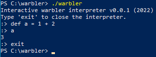
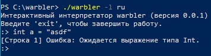
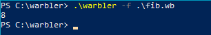
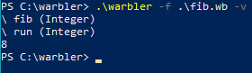

# warbler

## About

**warbler** is a programming language with bird-inspired syntax.

It's a side-project I started in order to learn how to design programming languages.

Right now, it's an interpreted language. Eventually it will be a compiled one.

## Features

**warbler**'s current features are:

- no statements - everything is an expression
- static typing
- null-safety
- local variable type inference (like ```var``` in C#)
- ```:>``` bird-inspired syntax ```<:```

Some of the features planned for the next versions:

- optional types (like ```nullable value types``` in C# or ```Maybe``` in Haskell)
- pattern matching

## Versions

The latest **warbler** interpreter version is **0.0.1**.

## Interpreter usage

- Run the interpreter in the command line to start an interactive session:

  

  Type ```'exit'``` to end the session.

- Use the ```-l|--language``` option to set message language to Russian (default is English):

  

- Use the ```-f|--file``` option to run a ```.wb``` source code file (sample files can be found in the *samples*
  folder):

  

- Use the ```-v|--verbose``` option to print all evaluation results (including the results of evaluating
  function/variable declaration expressions):

  

###### Important:

It's currently not possible to evaluate functions with 1+ parameters in the interactive sessions. It is a known bug
that's yet to be fixed.

## Extra info

1. Right now, the interpreter's architecture is heavily based on the one presented
   in [Crafting Interpreters](https://craftinginterpreters.com/) (*which is a really cool book!*). As I add more
   features, it will probably become more of its own thing.
2. *"Warbler"* is the name of a whole bunch of tiny birds, which is fitting for a language with bird-inspired syntax
   that
   might eventually get several implementations/dialects.
3. The **warbler** language is licensed under the **MIT License**. If you find **warbler** interesting, feel free to use
   it in your own projects or contribute something new.
